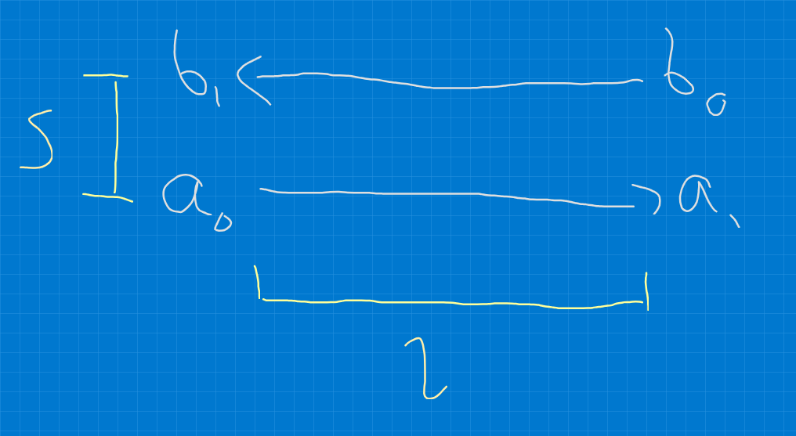
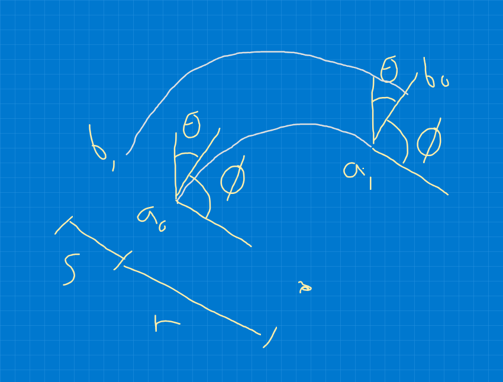
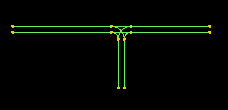

# Simulating traffic junctions with Python

I am interested in whether I can simulate traffic flowing through
junctions in various ways using some simulations.

* What junctions achieve the most throughput
* What is the effect of splitting and merging lanes
* What is the effect of moving people to public transport, active travel
* etc etc

## The simplest junction

The simplest junction is no junction - just a road with vehicles going
back and forwards.

We can name two lanes $a$ and $b$ and assume that vehicles will one
day traverse them from start to end. 

We can define the road by the parameters:

* $l$ - road length (distance along either of the lanes)
* $s$ - lane separation (distance between the lanes)
* $\theta$ - angle of the road. Thinking of it as a compass
  bearing, let $\theta=0$ mean that lane $a$ runs northbound,
  with increasing $\theta$ rotating clockwise on the map
  ($\theta=\pi/2$ means eastbound etc).

The lane start is a 2D coordinates $a_0$ (or $b_0$)
and end at coordinates $a_1$ (or $b_1$). In the diagram below we also
label the road length $l$ and separation $s$ (being the distance
in-between the two lanes).

## Circle-arc curve roads

Next in order of complexity is still not really a junction and just
a road, but since we want to construct a 2D map we will need to have
some capability to change the direction of roads. To achieve this we
need some kind of bendy road, and a simple example would be an "arc"
curve (i.e. a curve that follows a portion of a circle circumference).

This time we can define the shape by the lane separation $s$ (much
the same as before), the (inner) curve radius $r$. The angle $\theta$
is similar for the straight road and defines the "start" angle -
the bearing of the tangent at $a_0$ (or $b_1$) and $\phi$ is how much
of the circle we incorporate, i.e. the tangent at $a_1$ or $b_0$ is
$\theta+\phi$.

## T-Junction

A T-Junction is generally a connection between two roads - a "main"
road and a "side" road. If we make the simplifying assumption that
the main road and side road are the same width, and the side road is
perpendicular, then a T-junction is fairly trivial to construct by
combining a section of straight road (for vehicles staying on the
main road) with two arc-shape roads (for vehicles leaving or entering
the side road).

