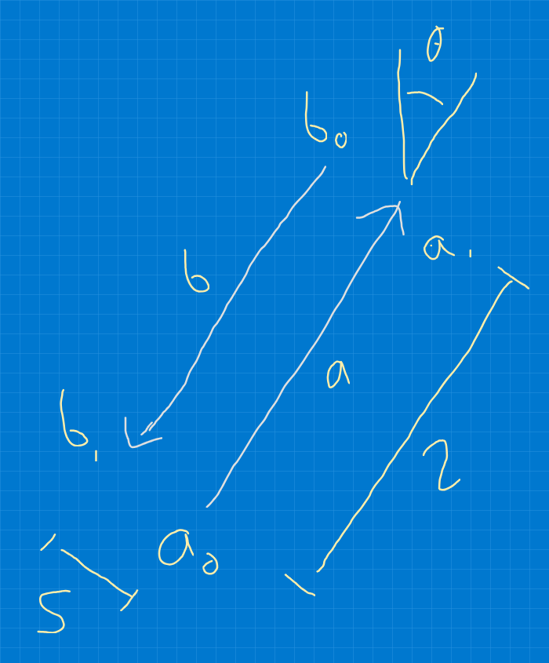

# Simulating traffic junctions with Python

I am interested in whether I can simulate traffic flowing through
junctions in various ways using some simulations.

* What junctions achieve the most throughput
* What is the effect of splitting and merging lanes
* What is the effect of moving people to public transport, active travel
* etc etc

## The simplest junction

The simplest junction is no junction - just a road with vehicles going
back and forwards.

So define two lanes, A and B, and start/end points for each in 2-D space. 
The road is defined by a road length $r$ and separation between lanes $s$.

