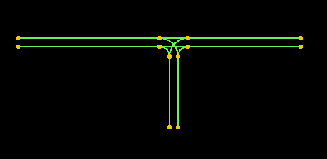
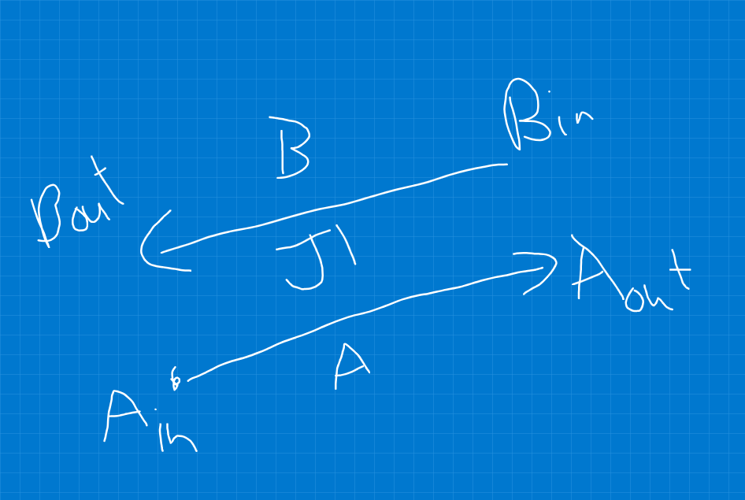
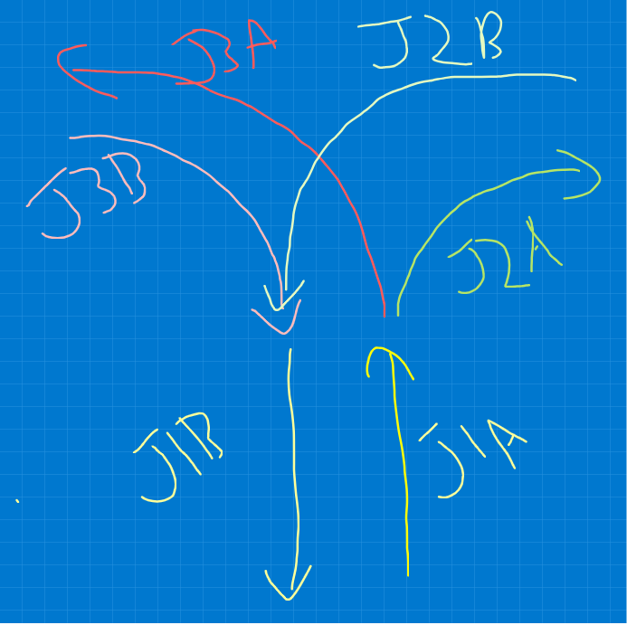
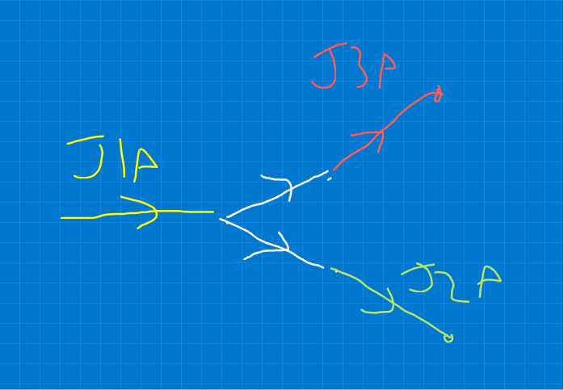

# Joining junctions into a network

Having some simple junction primitives (straight roads and arcs)
and even a composite junction (a T-junction) - we need a way to
combine these into a road network that connects points together.

Simply by placing junctions "next to" each other in physical space
we have implied a network:



However, its also useful to computationally represent the connectivity
between junctions. If we want to later simulate vehicles traversing the
network, it would generally be better to have a map of the logical
connections between junctions rather than rely on the physical layout
when vehicles need to cross the boundaries between junctions.
Similarly, a logical connectivity map would be useful to implement
things like path-planning.

## Representing connectivity on top of junction primitives

The junction primitives we have are defined in terms of two or more
lanes, generally one going in each direction. The lanes are directional,
so in general each lane is going to have an "in" and and "out" point.
A junction is therefore going to have a collection of implicitly matched
in and out points. 

For example in this illustration:

* Label the junction $\mathrm{J1}$
* It has two lanes $\mathrm{A}$ and $\mathrm{B}$, or if we need to 
  disambiguate them from another junction call them 
  $\mathrm{J1A}$ and $\mathrm{J1B}$.
* Each lane has an in and and out node, 
  $\mathrm{J1A_{in}}$, $\mathrm{J1A_{out}}$ etc.





To construct a network, we need to connect the lanes together in an
orientation that vehicles can traverse, in other words, each 
connection will be between one lane's out node and the in node of
another lane (in a different junction).

For example, given a network of three junctions (J1 is a road and
J2 and J3 are arcs):



Note first that the connectivity network here will split into two
disconnected subgraphs - one for the A lanes and one for the B lanes,
as in this example there is no way to loop round to the other set
of lanes.

The A-lane network has the J1A lane, with its end connected to
the start of J2A and J3A. This image shows the graph with extra
white edges to highlight the connection points (the white edges
are not true lanes).



This is a directed graph / digraph. The lanes can be thought of as
edges and the lane in/out points are vertices. Each vertex can be at
the "out" of (at most) one lane but connected it to zero or many "in"
points of subsequent lanes.

## Representing the graph in Python

The `Network` class is used to encapsulate junctions and
connections between them.

First, we can use it to capture some primitive junctions. Each
junction gets a unique _label_ which is used to look it up
later. We can assign the label ourselves or in this example
let the `Network` class pick a unique label for us.

```python
>>> from junctions.network import Network, LaneRef
>>> from junctions.types import Road

>>> network = Network()

>>> road1 = Road(origin=(10, 10), bearing=0, road_length=10, lane_separation=5)
>>> road2 = Road(origin=(10, 20), bearing=0, road_length=10, lane_separation=5)

>>> # The network assigns names to the junctions for us and
>>> # returns them
>>> j1 = network.add_junction(road1)
>>> j1
'road1'

>>> j2 = network.add_junction(road2)
>>> j2
'road2'

>>> network.junction_labels()
('road1', 'road2')

>>> # Can get junctions back from junction lookup
>>> network.junction(j1) == road1
True

```

Additionally use the network to keep track of all the lanes
in the system. The lane labels will be determined by the junction
type, e.g. for roads it will be `'a'` and `'b'` for the two lanes.

```python
>>> # Each road will have a list of lanes
>>> network.lane_labels(j1)
('a', 'b')

>>> # And we can look up the lanes
>>> network.lane(LaneRef(j1, 'a')) == road1.lanes['a']
True

```

Finally, the `connect_lanes` method lets us join two lanes,
identifying each one by the road label/lane label pair.
We are always connecting a lane out/end to a lane in/start, 
so just referencing the two lanes is enough to define what
is being connected.

```python
>>> # Connect J1A end to J2A start
>>> network.connect_lanes(LaneRef(j1, 'a'), LaneRef(j2, 'a'))

>>> # List all the connections made in the network
>>> network.connected_lanes(LaneRef(j1, 'a'))
(LaneRef(junction='road2', lane='a'),)

```

## Enforcing connector colocation

For the network to make physical sense, connections should be
between lane out and in points that are located at the same physical
spot. This is dependent on having the origin, lane separation etc 
of the junctions matched appropriately so the lane vertices have 
the right physical location.

This isn't something that has been enforced at any point in the
current modelling, so two roads could be completely separate in
space, and have a connection between them. Validating the locations
of the connections would be a useful addition to this model, but
isn't implemented yet.