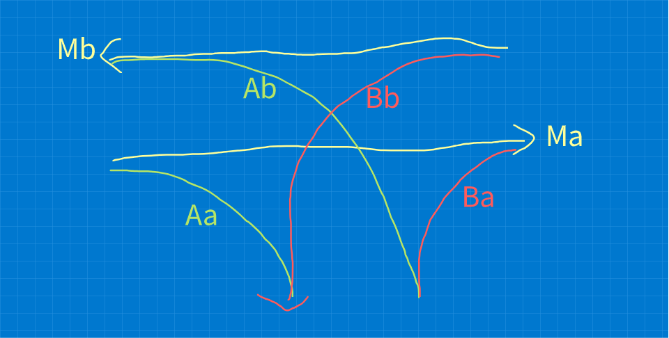

# Simulating vehicles through the network

Vehicles are the main agents in the simulation. A vehicle's state
consists mainly of its position in the network, i.e. which lane
it is on, and a position on that lane.

## Moving around the map and lane priority

Recall the logical form of the connectivity map: directed edges or 
_lanes_ which are connected at vertices. Each vertex consists of zero
or more _connections_ which are pairs of lanes which are connected
from end-to-start.

Each vehicle is simulated moving along a lane. When it reaches the end
of the current lane it picks a connection (if there is one) which will
move it (usually immediately) to the start of the next lane.

Some lanes will physically conflict, for example at junctions like 
T-junctions, the lanes emerging from the side cross over the main road
lanes.

In order to prevent collisions between vehicles, they can be prevented
from crossing immediately into a new lane by putting a _wait_ flag on the
lane they are moving to. When a vehicle tries to cross a connection with 
a _wait_ flag set on the next lane, it has to stop on its current lane
until the connection is clear. (This doesn't affect vehicles already on
the target lane, which should continue moving to clear the lane).

### T-Junction lane priority

The principle with a T-junction is that traffic going straight on the
main road has priority, and traffic turning in or out of the side road
should wait for the lanes to be clear.

Looking at the T-junction schematic, we have three sections consisting
of two lanes each: the main road (straight road) with lanes 
_Ma_ and _Mb_ and the two branches - branch A (arc) _Aa_ and _Ab_, 
and branch B (another arc) with _Ba_ and _Bb_.

We can define the wait condition to enter each lane based on the priority
of the main road:

* _Ma_ and _Mb_, and _Aa_ never have a wait condition
* _Ab_ waits if it is not clear on _Ma_, _Mb_ or _Bb_.
* _Ba_ waits if it is not clear on _Ma_.
* _Bb_ waits if it is not clear on _Ma_ or _Aa_.

## Speed limits

Each lane is given a speed limit, and normally a vehicle moves
along the lane at that speed limit.

It's fairly arbitrary but its probably easiest to think of the
dimensions and speeds in terms of meters and meters/second. So a lane
separation of 5 means a 5-meter wide road. A speed of 11 means 11 m/s.

For reference some speed limits close to common real world values:

| m/s | k/mh | mph |
| --- | ---- | --- |
|   6 |   22 |  14 |
|   9 |   32 |  20 |
|  14 |   50 |  31 |
|  22 |   79 |  50 |
|  28 |  101 |  63 |

## Vehicle dynamics

The system state consists of the static network definition:

$$Q = \{N_l, C, L, S\}$$

And the dynamic state variables:

$$q(t) = \{n_v, w, l, x\}$$

* The number of lanes $N_l \in \mathbb{Z}^+$
* The connection matrix $C$ which defines which lanes are connected.
  For each lane index $i, j \in \{1\dots N_l\}^2$ we have a connection
  indicated by $C_{ij} \in \{0, 1\}$.
* For each lane with index $i \in \{1\dots N_l\}$:
   * Length $L_i \in \mathbb{R}^+$.
   * Speed limit $S_i \in \mathbb{R}^+$.
   * Wait flag $w_i \in \{0, 1\}$.
* The number of vehicles $n_v \in \mathbb{Z}^+$ (vehicles can be added and
  removed).
* For each vehicle with index $i \in \{1\dots n_v\}$.
  * The index of the current lane for that vehicle (can be unset for
    an inactive vehicle): $l_i \in \{\empty, 1\dots N_l\}$.
  * The index of the proposed next lane for the vehicle: $p_i$. This
    must be one of the lanes that follows on from the current lane $l_i$,
    or it can be unset.
    $$ p_i \in \{\empty, j : C_{l_i}j = 1\} $$
  * The current vehicle position on its lane (can be unset if the
    vehicle is inactive): $x_i \in \${\empty, [0, L_{l_i}]\$}$.

Additionally defined $Drain(i) = \{j : C_{ij}= 1\}$ - the set of lanes
that lane $i$ connects to, and $Feed(i) = \{j : C_{ji}=1\}$ - the set
of lanes that connect to lane $i$.

We will assume these values have been suitably initialised and cover here
the dynamic updates - i.e. how we simulate vehicle movement in the
network.

On each discrete time step $\Delta t$, we apply
the following algorithmic loop to update the vehicle positions and lanes:

1. Calculate the next set of vehicle positions and lanes. For each
   vehicle index $i$:

   $$ \{x_i, l_i, p_i\}(t+\Delta t) = MoveVehicles(Q, q(t), \Delta t, i)$$

2. For each lane index $i$, update the wait flags:

   $$ w_i(t+\Delta t) = Wait(Q, q(t), i)$$

3. The updated dynamic state consists of the results of steps 1 and 2:

   $$ q(t+\Delta t) = \{x, l, p, w\}(t+\Delta t) $$

   We can set $t=t + \Delta t$ and loop back to step 1 to continue the
   simulation in discrete steps.

### Function: _MoveVehicles_

This function takes the current state and calculates a new set of
position, lane and planned lane values for a given vehicle $i$ by
simulating a time step $\Delta t$.

$$MoveVehicles(Q, q(t), \Delta t, i) \to \{x_i, l_i, p_i\}$$

1. Given a vehicle $i$ on lane $l = l_i$ where $l \neq \empty$:

2. Propose a new vehicle position $x'_i = x_i + s_l \Delta t$.

3. If the proposal is less than the lane length $x'_i \le L_l$:

   1. Take the proposal as the new position, do not change the other
      state variables - the function result is $\{x'_i, l_i, p_i\}$

4. Else:

   1. Choose a new lane and calculate a position on that lane - the
      result for vehicle index $i$ is

      $$TransitionToNewLane(Q, q(t), i, x'_i)$$

### Function: _TransitionToNewLane_

This function takes the current state for a given vehicle $i$ and
a proposed new position $x'_i$ and calculates a suitable transition
to a new lane as appropriate.

$$TransitionToNewLane(Q, q(t), i, x'_i) \to \{x_i, l_i, p_i\}$$

1. Given a vehicle index $i$ on lane $l$ which has a proposed lane 
   position $x'_i$ greater than the current lane length $L_{l}$.

2. Determine the proposed next lane $l'_i$:

   1. If there is already a planned next lane, $p_i \neq \empty$:

      1. $l'_i = p_i$

   2. If $p_i = \empty$:

      1. Pick a next lane index $l'_i$ at random from $Drain(i)$.

      2. If there are no such lanes ($Drain(i)$ is empty),
         remove the vehicle from the simulation. This function returns 
         $\{\empty, \empty, \empty\}$.

3. If the wait flag is set on the proposed lane: $w_{l'} = 1$:

   1. Use $l'$ as the planned next lane, but keep the vehicle $i$ at
      the end of the current lane. This function returns

      $$\{L_{l_i}, l_i, l'_i\}$$

3. If the wait flag is not set: $w_{l'} = 0$:

   1. Invert the time step to find the amount of time the vehicle was
      past the end of its lane: $$t' = \frac{x'_i-L_{l_i}}{S_{l_i}}$$

   2. Calculate a new proposed lane position $x''_i$ on the new
      lane using the speed limit of the new lane. Generally assume that
      the new position will not be beyond the end of the next lane, but
      we will constrain it in case it would be: 

      $$ x''_i = \min(S_{l'} t', L_{l'}) $$

   3. Return the new position on the new lane, there is no planned
      next lane at this point:

      $$ \{x''_i, l'_i, \empty\} $$

### Function: _Wait_

This function determines whether the wait flag $w_i$ should be set for
lane $i$ in the network.

   $$Wait(Q, q(t), i) \to w_i$$

1. Establish $Priority(i)$ as the set of lanes that have priority 
   over $i$.

2. If there is a vehicle $j$ with $l_j \in Priority(i)$ then this function
   is 1 - the wait flag should be set.

3. Otherwise:
   
   1. Calculate the time it takes for a vehicle to enter and clear this lane
      at the speed limit:
      
      $$T_i=L_iS_i$$

   2. For all priority lanes $j \in Priority(i)$:

      1. For all the feeder lanes $k \in Feed(j)$:

         1. Find the vehicle $z$ with the maximum position on lane $k$:
            
            $$z = \argmax_{y}\{x_y : l_y = k\}$$

         2. If that vehicle can reach the end of its lane in less than
            the time needed to clear the junction:

            $$T_i \gt S_k(L_k-x_k)$$

            1. Then set the wait flag (this function returns 1)

   3. If none of the above conditions are met, return 0 (clear the
      wait flag).

   